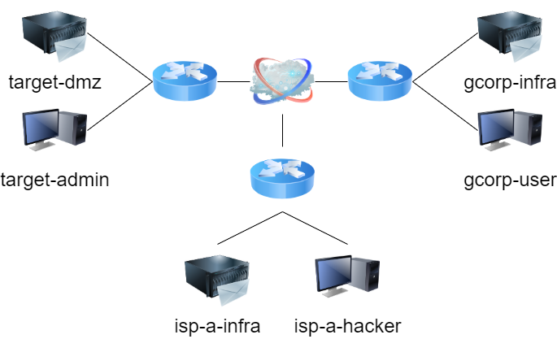
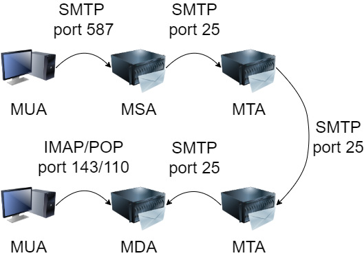
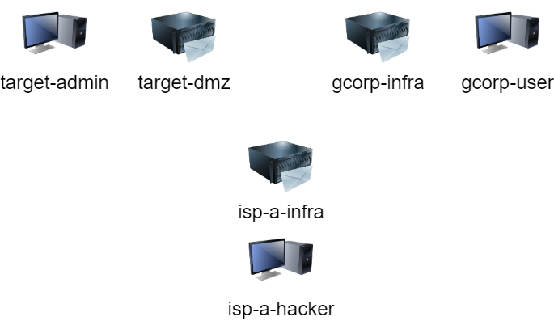

# TP milxc et sécurité des échanges par mail

## Introduction

Nous allons voir dans ce TP, différentes failles présentes dans les échanges par mail, ainsi que différentes mesures pour réduire les risques. Pour ce faire, nous allons utiliser **milxc** qui est un système basé sur des conteneurs **lxc** simulant un mini-internet. Vous pouvez entrer la commande `./mi-lxc.py print` pour afficher la représentation du réseau étudié si besoin.

Nous allons principalement nous intéresser aux sous-réseaux **target**, **gcorp** et **isp-a**. Dans ceux-ci, les machines que nous allons manipuler seront principalement **target-admin** et **target-dmz**, **gcorp-user** et **gcorp-infra** ainsi que **isp-a-hacker** et **isp-a-infra**. Pour accéder à ces machines, vous pouvez entrer la commande `./mi-lxc.py attach target-admin` pour accéder à la machine admin de la branche target. Pour une meilleure compréhension, voir le tableau ci dessous. 

| Branches     | gcorp       | target       | isp-a        |
| ------------ | ----------- | ------------ | ------------ |
| Serveur mail | gcorp-infra | target-dmz   | isp-a-infra  |
| Client mail  | gcorp-user  | target-admin | isp-a-hacker |

L'utilisateur **isp-hacker** va chercher à exploiter les failles de l'infrastructure, et votre travail va être de sécuriser l'infrastructure de mail des compagnies **gcorp** et **target**. Les machines des clients possèdent un client de messagerie **claws mail** vous permettant d'envoyer vos messages pour tester vos configurations. Pour les plus curieux, vous pouvez utiliser la commande `nc` (Exemple en annexe) . Enfin, des mails automatiques peuvent être écris dans le fichier `mailscript/scenarii.json`. Ces tests seront exécutés avec la commande `./mi-lxc.py mail` (Exemple en annexe).

Vous pouvez trouver ci dessous un résumé de l'architecture que vous allez manipuler : 



## Première approche

**Question 1 :**  Avec l'architecture actuelle, donnez 2 exemples d'échange de mail frauduleux, essayez de les mettre en place.

Il est bon de savoir que les serveurs de mail on pris l'habitude de se séparer les taches en deux. Deux ports sont ouverts sur le  serveur ; les ports **587** et **25**.  Le port 25 était le port par défaut par lequel tous les échanges  passaient. Maintenant, le port 587 est ouvert pour permettre aux clients finaux de parler avec leur serveur directement, et le port 25 sert à communiquer uniquement entre serveurs mail. Cette séparation a pour but de réduire les spams en forçant à communiquer via un serveur de mail. Si ce dernier obtient une mauvaise réputation il pourra être black-listé et les serveurs ne l'écouteront plus. 

Ci dessous, une représentation graphique d'un envoie de mail : 



- MUA : Mail User Agent
- MSA : Mail Submission Agent
- MTA : Mail Transfert Agent
- MDA : Mail Delivery Agent

Dans notre architecture, il n'y a pas de serveur intermédiaires **MTA** entre nos différents serveurs de mail. 

**Question 2 :** Dans la configuration actuelle, cette séparation des tâches est-elle mise en place sur tous les serveurs mails ? Mettez en place cette configuration dans le cas où elle n'est pas encore appliquée.

Comme expliqué ci-dessus, le port **587** autorise seulement les clients finaux du serveur à communiquer avec ce dernier. On va donc chercher à restreindre l'accès à ce port sur les serveurs mail uniquement aux clients dont **l'adresse IP** appartient à un certain **sous-réseau**. 

**Question 3 :**  Cette restriction est-elle actuellement appliquée sur les serveurs mail ? En vous aidant de la documentation de postfix, quelle(s) paramètre(s) peuvent être utilisés pour appliquer cette restriction ? Complétez le schéma ci dessous avec des scénarii que vous venez d'interdire (vous pouvez utiliser plusieurs couleurs). 



**Question 4 :** Maintenant que vous avez appliqué cette restriction, quelle erreur obtenez vous lorsque vous essayez de reproduire le comportement interdit ? Ou les messages d'erreurs sont-ils stockés sur le serveur de mail ?

Autoriser seulement son sous-réseau n'est pas suffisant pour pour protéger le port 587 de son serveur mail. On veut aussi éviter que les utilisateurs finaux effectuent des actions malveillantes. On ne veut pas qu'un de nos utilisateurs usurpe un nom de domaine ne nous appartenant pas par exemple. 

**Question 5 :** Avec la configuration établie aux questions précédentes, proposez une scénario ou un client usurpe l'identité d'un client externe.

**Question 6 :** Proposer et implémenter une solution pour empêcher cette action.

Avec la configuration actuelle, les port 587 des serveurs de mails sont biens configurés. Pour autant, nous n'avons rien imposé comme restrictions sur le port 25. De plus, même si nos ports sont correctement configurés, rien ne nous garantit que tous les serveurs de mails respectent une bonne configuration.

## SPF

SPF pour **Sender Policy Framework** est un mécanisme de sécurité permettant la vérification du champs **MAIL FROM** lors de l'échange SMTP. Le serveur va effectuer une requête **DNS** de type **TXT** au nom de domaine présent dans le MAIL FROM pour vérifier que l'émetteur respecte bien les conditions de la politique **SPF**.  

**Question 7 :** Afficher la politique SPF de **gcorp.milxc** et expliquez.  Vous pouvez utiliser `dig` pour vous aider. **isp-a.milxc** et **target.milxc** possèdent-ils une politique SPF ?

**Question 8 :** Montrez qu'un utilisateur extérieur peut toujours usurper l'adresse mail de **gcorp-user**.

Pour implémenter la politique **SPF**, nous allons utiliser **policyd-spf**. Il faut installer le package avec la commande `sudo apt-get install postfix-policyd-spf-python`. 

**Question 9 :** En vous aidant de `man policyd-spf` (ou autres sources) effectuez les manipulations pour activer **SPF** avec **postfix**.

**Question 10:** Avez vous pensé à rajouter la politique SPF dans la configuration DNS ? Si non, vous pouvez trouver le fichier à modifier dans `/etc/nsd/****.zone` dans les serveurs de mail.

**Question 11 :** Pouvez vous toujours usurper l'adresse d'**admin** ou de **user** avec **hacker** ?

**Question 12 :** Proposez divers scénarios à tester pour montrer que votre implémentation est bonne. Aidez-vous du fichier **scénarii.txt** et de la commande `./mi-lxc.py mail` pour vérifier votre configuration.

**Question 13 (bonus) :** Quelles sont les limites d'une telle politique SPF ? Avec une architecture plus complexe, proposez un scénario ou un mail légitime ne serait pas accepté.

## Annexes et remarques

Pour envoyer des mails avec `nc`:

```
$ nc smtp.*****.milxc port
HELO mail.serveur 
MAIL FROM:<******@****.milxc>
RCPT TO:<****@*****.milxc>
DATA
Subject : Le sujet de votre message (Optionnel)
From : expediteur@sonmail.milxc (Optionnel)
To : destination@sonmail.milxc (Optionnel)*
Le corps de votre message (Optionnel)
.
QUIT
```

Pour envoyer des mails avec le fichier `mailscript/scenarii.json` :

```
{
"mail1" : {
	"Server" : "mail.serveur",
	"ServerPort" : port,
	"From" : "Nom<*****@*****.milxc>",
	"To" : "*****@*****.milxc",
	"Subject" : "Le sujet de votre message",
	"Body" : "Le corps de votre message",
	"Container" : "d'où vous voulez envoyer le mail",
	"ShouldPass" : true (si le mail doit être reçu)
	},
```

Il faut ensuite exécuter la commande : `./mi-lxc.py mail`.

Lien intéressant pour manipuler les différents paramètres de postfix : https://man.archlinux.org/man/postconf.5

Pour les questions 1 à 6, regardez principalement :

 `smtpd_client_restrictions` et `smtpd_sender_restrictions`.

Pour la question 6, si vous pensez avoir juste mais que vous êtes bloqués n'hésitez pas à demander de l'aide à un enseignant ! La solution peut être subtile. 

